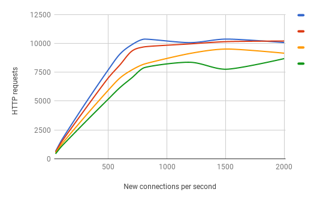

# [PacketBL](https://www.zevenet.com)
This Packetbl software is a new NON-OFFICIAL version of a not maintained project with this same name, this project was developed by Russell Miller. Later, it was incluided in CentOS repositories and now, it has been improved by Alvaro cano of ZEVENET team.
The goal of this program is to connect netfilter with user space to check if a origin IP is malicious using a DNS server as a realtime database.
Packetbl uses netfilter-queue feature to receive a packet from netfilter to user space.

Packetbl will reject or will drop a connection if a DNS server resolves the queried client IP. So the DNS server will be used as a service of dynamic black lists. Those black lists are supported by
specialist security providers, you can find some of them here: https://en.wikipedia.org/wiki/Comparison_of_DNS_blacklists

Some RBL domains are:

- zen.spamhaus.org
- dnsbl.njabl.org
- all.rbl.webiron.net
- bl.spamcop.net
- dyna.spamrats.com
- all.bl.blocklist.de


# RBL
RBL or DNSBL is a tech that does DNS queries about a source IP to determinate if the IP is blacklisted. If the source IP is resolved by a remote DNS serve, the malicious packet can be dropped, rejected or logged to mitigate a cyber-attack.
RBL technology is typically used to mitigate email threats as spam or phishing. But it is useful for another services as FTP, SIP, SSH, web...


# New features
- Multi-thread, Packetbl will create a thread for each checking packet.
- Direct DNS queries, Packetbl can use a determinate DNS server to resolve a specific domain.
- Fail-over, This option is available since Linux 3.6 and allows to accept packet instead of dropping them when the netfilter queue is full.
- Queuesize, this parameter allows to set Netfilter queue size.
- Select a config file, it is possible to choose a packetbl config file with the "-f" command line option.


## Installation and runtime
Packetbl has been tested in stable debian distributions: Wheezy, Jessie and Stretch

### Prerequisites
	1. Dot.conf (required)
		Dot.conf is used to handle the configuration data and is
		required for PacketBL to operate.
		Dot.conf uses "Apache-style" configuration files so logical
		hierarchal configuration files can be used.

	2. libldns (required)
		This library is used to send DNS queries to a DNS server.

	3. iptables (required)
		Iptables' library "ipq" (IP Queuing library) is required, it
		provides the necessary hooks to allow PacketBL to accept
		packets from the QUEUE target and process them.

	4. FireDNS (optional)
		FireDNS is a library that queries all configured nameservers in
		parallel and once it gets an answer from one of them reports
		this.  It can make name resolution MUCH faster, especially when
		a configured nameserver is unreachable or down.


### Dependencies
- Compiling dependencies:
```
libldns-dev libdotconf-dev libnetfilter-queue-dev libnfnetlink-dev
```

- Executing dependencies
> wheezy:
```
libdotconf1.0 libldns1 libnetfilter-queue1 libnfnetlink0
```

> jessie
```
libdotconf0 libldns1 libnetfilter-queue1 libnfnetlink0 libdotconf-dev
```

>stretch
```
libdotconf0 libldns2 libnetfilter-queue1 libnfnetlink0 libdotconf-dev
```

### Installation on Debian

PacketBL uses a GNU autoconf style `configure' script for
   configuration.  To invoke this script run the `configure' script
   within the top-level source directory, for example:
	./configure
   There are a few options that can be passed to the `configure' script
   that will affect the way PacketBL is built (in addition to the
   standard autoconf `configure' script options):

	a. --with-cache
		This option will enable the experimental caching
		mechanism.  This may introduce unexpected problems.
		If you encounter any problems you should post a bug
		report to the PacketBL mailing list (for details, see
		http://lists.duskglow.com/packetbl).
	b. --with-firedns
		This option will cause PacketBL to use FireDNS's name
		resolution routines when testing IPs against DNS RBLs.
		Read above for more information on FireDNS.
	c. --with-stats
		This option will enable the experimental statistic
		gathering code, which will require an extra thread to
		handle incoming connections to a UNIX domain socket.
	d. --with-stats-socket=/path/to/socket
		This option allows one to specify the path to the UNIX
		domain socket that is used for communications between
		the PacketBL daemon and the "packetbl_getstat" process.
		Default is /tmp/.packetbl.sock.

To install Packetbl, execute the following commands:

```
git clone https://github.com/zevenet/packetbl.git
cd /packetbl/src
./configure [OPTIONS]
make
make deb
sudo dpkg -i ../packetbl.deb
```

### Config file

	1. The configuration file (packetbl.conf) is in "Apache-style" format.
	   An example configuration file might look something like this:
		<host>
			# blacklistbl/whitelistbl domain
			blacklistbl    bl.blocklist.de
			blacklistbl    zen.spamhaus.org
			blacklistbl    my.own.dnsbl    # this domain is a example
			whitelistbl    whitelist.domain.com    # this domain is a example

			# whitelist/blacklist cidr
			blacklist    4.87.4.4  # this IP is a example
			whitelist    192.168.0.0/16
			whitelist    169.254.0.0/16
			whitelist    172.16.0.0/12
			whitelist    10.0.0.0/8
		</host>
		FallthroughAccept    yes
		AllowNonPort25        yes
		AllowNonSyn        no
		DryRun            no
		CacheSize        8192
		CacheTTL        3600
		LogFacility        daemon
		loglevel            5
		AlternativeDomain    my.own.domain
		AlternativeResolveFile    /usr/local/etc/packetbl/optional_resolvers
		Quiet            no
		Queueno        0
		Queuesize    2048
		Threadmax    700

	2. Explanation of configuration elements:
		a. <host>
			This element begins the HOST section of the
			configuration.  You must define your Blacklists/Whitelist DNS
			RBLs and Whitelist/Balcklist addresses in the HOST section.
		b. BlackListBL dnsbl.sorbs.net
			The "BlackListBL" element defines a DNS RBL which is
			checked to determine whether or not packets are
			dropped.  This particular example configures
			"dnsbl.sorbs.net" as an RBL to use.
		c. WhiteList 127.0.0.0/8
			The "WhiteList" element defines a range in (CIDR
			format) of IP address to always accept and never check
			the configured "BlackListBL" elements.  You should
			usually leave at least "127.0.0.0/8" there for safety.
		d. FallthroughAccept yes
			The "FallthroughAccept" element tells PacketBL how to
			handle packets that are neither listed in a configured
			DNS RBL ("BlackListBL" element) nor match a configured
			whitelist ("WhiteList" element).  Usually you should
			leave this as "yes" (the default).
		e. AllowNonPort25 no
			The "AllowNonPort25" element controls whether or not
			PacketBL will examine packets that are passed it that
			do not have a "Destination Port" of 25 (SMTP).  This
			is probably not something you want, leaving it "no"
			is safe.  Enabling this and mis-configuring your
			iptables configuration could cause a LOT of load on the
			configured DNS RBLs and may cause you to lose access to
			them!
		f. AllowNonSyn no
			The "AllowNonSyn" element controls whether or not
			PacketBL will examine packets that are passed it that
			do not have the SYN flag set (i.e, incoming TCP
			connections). This is probably not something you want,
			leaving it "no" is safe.  Enabling this and
			mis-configuring your iptables configuration could cause
			a LOT of load on the configured DNS RBLs and may cause
			you to lose access to them!
		g. DryRun no
			The "DryRun" element controls whether or not PacketBL
			actually rejects (DROPs) the packets that match a
			configured DNS RBL.  Setting this to "yes" will cause
			all packets to be ACCEPTed.  The default is "no"
			which causes normal operation.
		h. CacheSize 8192
			The "CacheSize" element determines the size of the
			cache (in entries, not bytes or bits) if cache has
			been enabled at compile time.  A setting of "0" causes
			caching to be disabled.  The largest reasonable value
			is currently 21675, anything above that will be wasted.
			it is necessary execute configure with option "--with-cache".
		i. CacheTTL 3600
			The "CacheTTL" element determines the length of time
			(in seconds) that cached entries are considered valid.
			Once an entry is looked up through a configured DNS RBL
			it will not need to be looked up again until after its
			"Time To Live" has been exceeded.
			it is necessary execute configure with option "--with-cache".
		j. LogFacility daemon
			The "LogFacility" element controls which syslog facility
			PacketBL sends its information to.  The default is
			probably fine for most people.
		k. Quiet no
			The "Quiet" element controls whether PacketBL writes
			a message to syslog() every time it accepts or rejects
			a packet.  The safe choice (and default) is "no"
			meaning that PacketBL writes a message to syslog about
			every packet.
		l. QuietBL no. It overwrites the "Quiet" option for reject resolutions
		m. QuietWL no. It overwrites the "Quiet" option for accept resolutions
		n. loglevel 5
			Log lvl, syslog log levels from 0 to 7: 0 Emergency, 1 Alert, 2
                        Critical, 3 Error, 4 Warning, 5 Notice, 6 Informational, or 7 Debug.
                        Lvl 4 no resolution will be logged.
                        Lvl 5 IPs that match in dnsbl or blacklist/whitelist will be logged.
                        Lvl 6 All resolution will be logged. (It adds cache matches and default actions)
		o. AlternativaDomain my.own.domain
			This parameter is related with next one. Queries to this domain
			will be done using the resovlers of the file "AlternativeresolveFiles"
		p. AlternativeresolveFiles /usr/local/etc/packetbl/optional_resolvers
			This file is like /etc/resolv.conf. It will be used to get a lookup for
			the domain "AlternativaDomain". In this file must be appear the
			IP of the DNS server that resolves the domain.
		q. Queueno        0
			Specify a netfilter queue to packetbl
		r. Queuesize    2048
			Number of packets that can be stored in the netfilter queue.
		s. Threadmax    700
			Maximum number of threads. One thread is required to manage a
			packet. If this parameter is commented then there is not limit in the threads number.


### COMMAND LINE ARGUMENTS

	1. PacketBL supports a minimal number of command line arguments, since
	   most configuration should be done in the configuration file (see
	   previous section).  The following is a complete list of supported
	   command line arguments:
		a. "-q"
			The "-q" option causes PacketBL to be quiet, it is
			identical to setting "Quiet" to "yes" in the
			configuration file.
		b. "-V"
			The "-V" option causes PacketBL to print out its
			version number and other relevant information to
			standard output and exit successfully.
		c. "-h"
			Show the command line options.
		d. "-f <file>"
			Run packetbl using the file as configuration file.
		e. "-p <file>"
			Set a file where the PID is saved.
		f. "-d <level>"
			Run packetbl in debug mode. Level is a number between 0 and 3,
			been 3 the level with most information details.

	   Command line arguments always override their configuration file
	   counter-parts where appropriate.  Unknown command line arguments
	   cause PacketBL to terminate in error immediately at startup.

### Runtime
Once packetbl has been installed, run packetbl with a config file:
```
/usr/local/bin/packetbl -f /usr/local/etc/packetbl/packetbl_configfile.conf
```

It is necessary to fordward the origin packet to packetbl in order to query a DNS server.
It must be done with an IPtables rule, an example could be:
```
iptables -A INPUT -t filter -p tcp --dport 25 -j NFQUEUE --queue-num 0
```
With this rule, all SMPT input traffic will be fordwarded to netfilter queue 0
where packetbl receives the packets and query to the DNS servers. If the origin IP is resolved
by some of the DNS servers, Packetbl will apply an action to the packet (for example: drop, log or reject).

The "queue-num" parameter of IPtables must be the same than the "queueno" directive of Packetbl config file.


## Benchmark
For the test, a Nginx server has been stressed using the tool "wrk".
The following graph shows the number of HTTP resquest that Nginx has responsed with and without Packetbl.
This test has been done without configuring the Packetbl cache to simule that each HTTP request is from a
new client and to stress to Packetbl.

In this benchmark packetbl was compiled without firedns.
Packetbl was running in a Debian Stretch.



- The vertical axis shows the number of success HTTP requests per second.
- The horizontal axis shows the number of concurrent clients doing HTTP requests.
- The domains number is the number of RBL domains where Packetbl is looking for the source IP (Packetbl does one DNS query for each domain).


### Conclusion

- Using Packetbl to check the origin IP in 4 domains, it has an average performance of 90%.
- Using Packetbl to check the origin IP in 10 domains, it has an average performance of 77%.
- Using Packetbl to check the origin IP in 15 domains, it has an average performance of 67%.


## How to Contribute
All reported bugs, new feature and patches are welcome.

### Reporting
Please use the [GitHub project Issues](https://github.com/zevenet/packetbl/issues) to report any issue or bug with the software. Try to describe the problem and a way to reproduce it. It'll be useful to attach the service and network configurations as well as system and services logs.


## [www.zevenet.com](https://www.zevenet.com)


